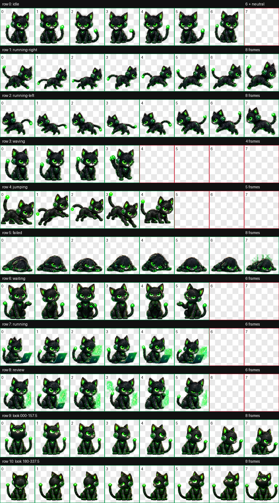

# Matrix Codex Pet

Matrix Codex is a cybernetic black cat illuminated by Matrix-green circuitry.
This repository contains the source artifacts, generated animation frames, QA
reports, and ready-to-install package for the Codex v2 animated pet.



## Highlights

- Codex pet format v2 (`spriteVersionNumber: 2`)
- 8 x 11 spritesheet with 192 x 208 pixel cells
- Final atlas size: 1536 x 2288 pixels
- Nine standard animation states: idle, running right, running left, waving,
  jumping, failed, waiting, running, and review
- Sixteen clockwise look directions in 22.5-degree steps
- Transparent WebP package with deterministic atlas validation and visual QA
- Magenta chroma processing preserves the character's neon-green circuitry

> [!NOTE]
> This repository is a Codex pet asset package, not a standalone application or
> a GitHub Pages website. To run it, install the packaged files into Codex.

## Install and run from GitHub

Clone the repository, then copy the packaged pet into your Codex pets directory.

### Windows PowerShell

```powershell
git clone https://github.com/Saprik13/matrix-codex-pet.git
Set-Location matrix-codex-pet

$petDestination = Join-Path $env:USERPROFILE ".codex\pets\matrix-codex"
New-Item -ItemType Directory -Force -Path $petDestination | Out-Null
Copy-Item "pet-runs\matrix-codex-v2\package\matrix-codex\*" $petDestination -Force
```

### macOS or Linux

```bash
git clone https://github.com/Saprik13/matrix-codex-pet.git
cd matrix-codex-pet

CODEX_PET_DIR="${CODEX_HOME:-$HOME/.codex}/pets/matrix-codex"
mkdir -p "$CODEX_PET_DIR"
cp pet-runs/matrix-codex-v2/package/matrix-codex/pet.json "$CODEX_PET_DIR/"
cp pet-runs/matrix-codex-v2/package/matrix-codex/spritesheet.webp "$CODEX_PET_DIR/"
```

Restart Codex after installation if the pet is not reloaded immediately.

The installed package contains:

```text
.codex/pets/matrix-codex/
|-- pet.json
`-- spritesheet.webp
```

## Project structure

```text
pet-runs/matrix-codex-v2/
|-- decoded/       Generated and approved animation strips
|-- final/         Final atlases and validation reports
|-- frames/        Extracted animation frames
|-- package/       Ready-to-install Matrix Codex package
|-- prompts/       Generation and repair prompts
|-- qa/            Contact sheets, previews, and QA evidence
|-- references/    Canonical artwork and layout guides
`-- source-backup/ Original pet files preserved before the v2 upgrade
```

The ready-to-install files are located at:

```text
pet-runs/matrix-codex-v2/package/matrix-codex/
```

## Validation

The packaged pet passed structural and visual QA:

- v2 manifest and 11-row atlas validated successfully
- zero validation errors and warnings
- all four cardinal look directions approved
- all 16 direction states reviewed as an ordered loop
- standard animation rows visually reviewed
- packaged and installed asset hashes verified as identical

Detailed evidence is available in
[`pet-runs/matrix-codex-v2/qa/`](pet-runs/matrix-codex-v2/qa/) and
[`pet-runs/matrix-codex-v2/final/`](pet-runs/matrix-codex-v2/final/).
